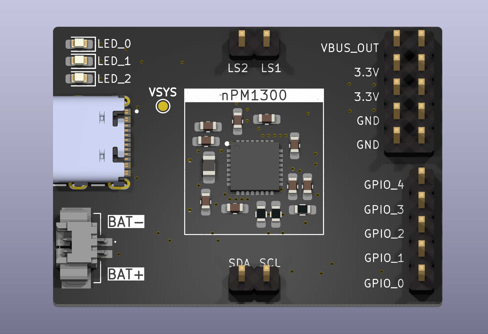

# nPM1300 Arduino Driver

> [!WARNING]
> The information and material (code, designs, files, ...) are provided "AS IS". We make no representation or warranty of any kind, express or implied, regarding the accuracy, adequacy, validity, reliability, availability, or completeness of any information or material. Use this at your own risk.

> [!WARNING]
> At the time of writing this driver is under active development, and is nowhere near ready for real-world usage

## Introduction

This an Arduino driver for Nordic's nPM1300 PMIC.

## Driver Development Status

- [x] Soft Reset (RESET)
- [x] LED Driver (LEDDRV)
- [ ] System monitor 
- [ ] System regulator (SYSREG)
- [ ] Battery Charger (CHARGER)
- [ ] Load switches (LOADSW)
- [ ] LDO (LDO)
- [ ] GPIO (GPIO)
- [ ] Events / Interupts

## Getting Started

```cpp
void setup() {
    Wire.begin();
    
    npm1300.led_set_mode(nPM1300::LED::LED0, nPM1300::LEDMode::ERROR);
    npm1300.led_set_mode(nPM1300::LED::LED1, nPM1300::LEDMode::CHARGING);
    npm1300.led_set_mode(nPM1300::LED::LED2, nPM1300::LEDMode::HOST);

    npm1300.set_vterm(nPM1300::V4_15);
    npm1300.ignore_ntc(true); // mandatory, if you don't have a ntc connected!
    npm1300.set_charge_current(400);

    npm1300.charger_on();
}
```
## Development Instructions

### Clean

```bash
pio run -t clean
```

### Build

```bash
pio run
```

### Upload

```bash
pio run -t upload
```

### Run Unit Tests

Run all tests:
```bash
pio test
```

Run specific suite:
```bash
pio test --filter "test_monitor"
```

## Hardware

This library is being developed and tested for my custom nPM1300 breakout board:

https://github.com/rroels/nPM1300-breakout



However, There is nothing in this driver that would prevent it from working with the nPM1300 EK Evaluation Kit or other boards.

## Troubleshooting

* Battery charging is not working.
  * By default, the nPM1300 expects an NTC to be present to measure battery temperature. If the battery does not have an NTC, you need to call `ignore_ntc()`. Without this hardware setting, the nPM1300 charging will not work if there is no NTC!

* The nPM1300 is not communicating over I2C when powered by battery.
  * Depending on your setup, if you are testing this with an Arduino, you might need a common ground for I2C to work (connect the arduino GND with the nPM1300 circuit GND).
  * [https://forum.arduino.cc/t/common-ground-and-why-you-need-one/626215/13](https://forum.arduino.cc/t/common-ground-and-why-you-need-one/626215/13)

## Sources 

* [https://docs.nordicsemi.com/bundle/ps_npm1300/](https://docs.nordicsemi.com/bundle/ps_npm1300/)
* [https://github.com/NordicSemiconductor/npmx](https://github.com/NordicSemiconductor/npmx)
* [https://github.com/MikroElektronika/mikrosdk_click_v2/tree/master/clicks/pmic](https://github.com/MikroElektronika/mikrosdk_click_v2/tree/master/clicks/pmic)
* [https://github.com/zephyrproject-rtos/zephyr/blob/main/drivers/regulator/regulator_npm1300.c](https://github.com/zephyrproject-rtos/zephyr/blob/main/drivers/regulator/regulator_npm1300.c)